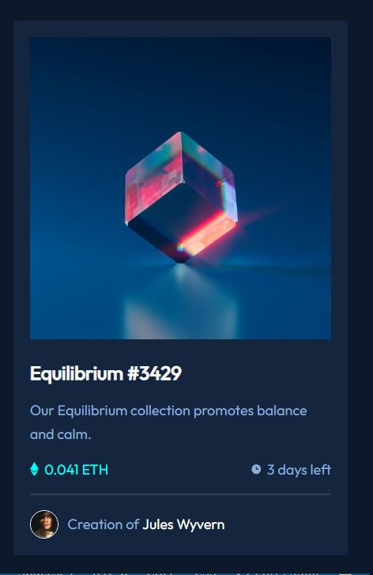

# Frontend Mentor - NFT preview card component solution

This is a solution to the [NFT preview card component challenge on Frontend Mentor](https://www.frontendmentor.io/challenges/nft-preview-card-component-SbdUL_w0U). Frontend Mentor challenges help you improve your coding skills by building realistic projects. 

## Table of contents

- [Overview](#overview)
  - [The challenge](#the-challenge)
  - [Screenshot](#screenshot)
  - [Links](#links)
- [My process](#my-process)
  - [Built with](#built-with)
  - [What I learned](#what-i-learned)
  
## Overview

### The challenge

Users should be able to:

- View the optimal layout depending on their device's screen size
- See hover states for interactive elements

### Screenshot



### Links

- Solution URL: [Add solution URL here](https://github.com/mriyaz/NFT-preview-card-component)
- Live Site URL: [Add live site URL here](https://mriyaz.github.io/NFT-preview-card-component

## My process

### Built with

- Semantic HTML5 markup
- CSS custom properties
- CSS Grid
- Mobile-first workflow

### What I learned

&lt;hr&gt; elements can have unexpected behavior when placed within a flex container. While they still technically render, they often appear invisible or compressed due to the way flexbox handles margins and alignment. Here's why:

Default &lt;hr&gt; styles:

By default, &lt;hr&gt; has margin-left: auto and margin-right: auto styles, which center it horizontally within its block container.
In a flex container, however, those auto margins can collapse, effectively shrinking the &lt;hr&gt; to 0 width and making it invisible.
Potential solutions:

One of the solutions is to override the margins:

You can override the default auto margins with explicit values like margin: 0; or margin: 0 auto; to prevent collapsing and allow the &lt;hr&gt; to expand with the available space.
```css
hr {
  margin: 0;
}
```
